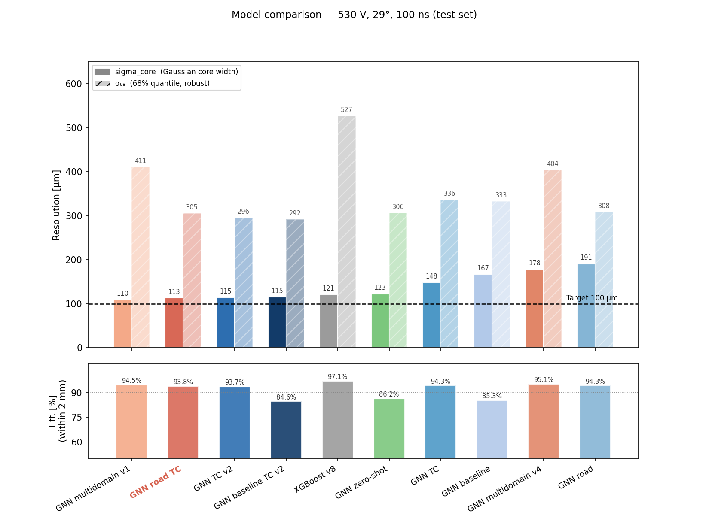
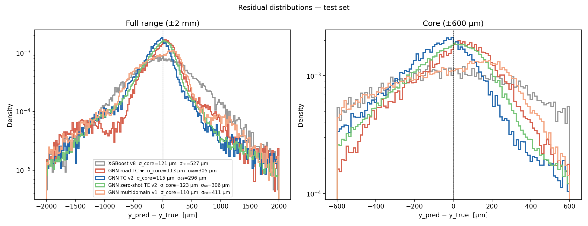
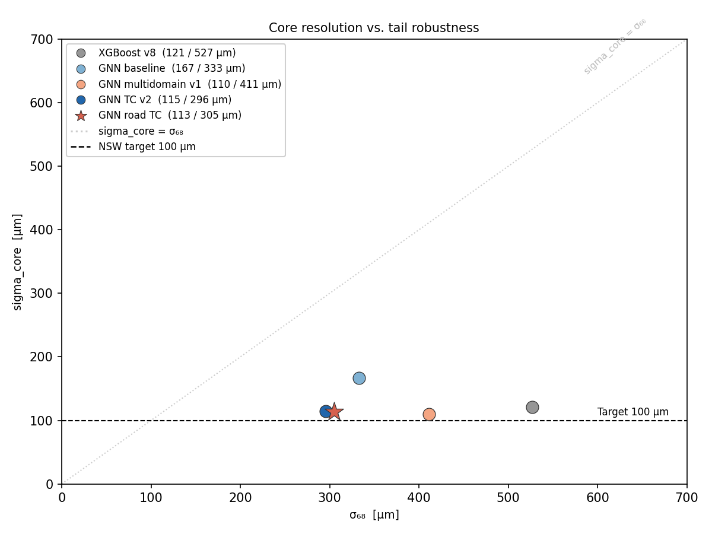
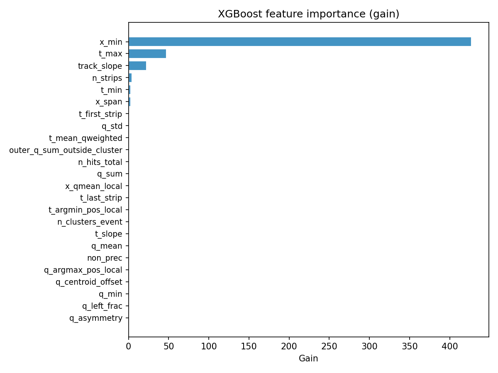

# Strip position reconstruction for the ATLAS NSW Micromegas detector

Bachelor thesis — LMU Munich, 2026  
Supervisors: Prof. Dr. Otmar Biebel, Dr. Fabian Vogel

This repository contains the full analysis code for comparing position reconstruction methods on testbeam data from a Micromegas SM1 prototype (530 V, 29°, Ar:CO2:iC4H10 93:5:2).

## Quickstart — what runs in what order

```bash
pip install -r requirements.txt
DATA=Data_for_Roman_29deg_530V_100ns_x9.root

python pipeline/01_diagnose.py        --data $DATA   # calibration -> outputs/detector_shift.json
python pipeline/03_train_xgboost.py                  # XGBoost     -> outputs/xgb_*.{npz,json}
python pipeline/04_train_gnn.py       --data $DATA --tc-anchor --out-prefix gnn_road_tc
python src/evaluate.py                               # comparison table over all models
python src/plots.py                                  # figures -> outputs/plots/

# optional, for understanding (not part of the pipeline):
python pipeline/02_analyse_features.py --data $DATA   # feature correlation + importance
python analysis/diagnose_inputs.py     --data $DATA   # input shape, gaps, feature stats
```

Everything reads a `.root` file via `--data` and writes to a shared `outputs/` at the
repo root. `evaluate.py` and `plots.py` pick up every `outputs/*_predictions.npz`
automatically, so run them last.

## Where is what

| I want to … | look in |
|---|---|
| run the reconstruction end to end | `pipeline/` (numbered 01→05) |
| change the model / data handling | `src/` (library — imported, not run) |
| understand why a model behaves as it does | `analysis/` (+ `analysis/README.md`) |
| see results / figures | `results/figures/`, or regenerate into `outputs/plots/` |

## Results



| Method | σ_core | σ₆₈ | efficiency |
|---|---|---|---|
| Charge-mean (Vogel h_residual_6) | 332 μm | — | — |
| XGBoost v8 | 121 μm | 527 μm | 97.1% |
| GNN road TC ⭐ | 113 μm | 305 μm | 93.8% |
| GNN TC v2 | 115 μm | 296 μm | 93.7% |
| GNN multidomain v1 | 110 μm | 411 μm | 94.5% |
| GNN zero-shot (100→200 ns) | 185 μm | 337 μm | 86.7% |

Two resolution measures are reported, since they answer different questions:

- **σ_core** — width of the narrow Gaussian in a double-Gaussian fit of the core
  (|residual| < 0.5 mm). Measures the intrinsic resolution of the well-reconstructed
  events. Follows the convention in Vogel's dissertation (Eq. 5.31).
- **σ₆₈** — half-width of the symmetric interval around zero containing 68% of *all*
  residuals, computed model-free as ½·(q₈₄ − q₁₆). Captures the tails as well, so it
  is the more honest single number. **Note:** this is not identical to the ATLAS σ₆₈
  definition; it is defined here purely from the residual quantiles.
- **efficiency** — fraction of events with |residual| < 2 mm (not a precision metric;
  it flags how often a method is not catastrophically wrong).







## Pipeline

The reconstruction runs as a numbered sequence in `pipeline/`:

**01 — Calibration** (`01_diagnose.py`)  
Detector shift and frame transform calibrated on the data. The charge-mean residual has a systematic offset corrected here. Run before training.

**02 — Feature analysis** (`02_analyse_features.py`)  
Correlation matrix and XGBoost importance over the 24 aggregated cluster features.

**03 — XGBoost baseline** (`03_train_xgboost.py`)  
24 aggregated cluster features (positions, charges, times). Strip-by-strip feature variants (v5–v7) did not improve performance — decision trees cannot model inter-strip dependencies. v8 is the structural limit of this approach.

**04 — GNN** (`04_train_gnn.py`)  
Strip self-attention model (Transformer encoder). Each strip is a node; the model learns interactions between strips directly. Variants:
- `baseline_100ns` — first working GNN, single dataset
- `gnn_road` — road-based strip selection (vs. cluster-based)
- `gnn_tc` / `gnn_tc_v2` — time-corrected centroid as anchor
- `gnn_road_tc` — road selection + TC anchor, best single-domain model
- `run_multidomain_v1–v4` — trained on 100 ns + 200 ns simultaneously

**05 — Generalization** (`05_evaluate_zeroshot.py`)  
Zero-shot transfer: model trained on 100 ns evaluated on 200 ns without retraining. TC-anchor variants generalize significantly better than charge-mean anchor variants.

## Structure

```
src/                    library code (imported, not run directly)
  data_loader.py        ROOT I/O, strip selection, frame transform
  dataset.py            PyTorch dataset, normalization, TC-centroid anchor
  features.py           24 aggregated cluster features for XGBoost
  model.py              strip self-attention GNN (Transformer encoder)
  fits.py               double-Gaussian fit + robust sigma_68
  evaluate.py           comparison table over all models
  plots.py              figure generation

pipeline/               executable steps, in order
  01_diagnose.py          detector shift, frame calibration
  02_analyse_features.py  feature correlation + XGBoost importance
  03_train_xgboost.py     XGBoost baseline
  04_train_gnn.py         GNN training loop
  05_evaluate_zeroshot.py zero-shot transfer to unseen shaping times

analysis/               data & model understanding (see analysis/README.md)
  diagnose_inputs.py        raw-data shape, gaps, feature properties
  analyse_gaps_vs_tails.py  do cluster gaps cause the XGBoost tails?
  analyse_time_outliers.py  do broken strip times cause the tails?
  analyse_xgb_tails.py      tree dump + tail-vs-core feature comparison

results/figures/        figures
```

All scripts write to a shared `outputs/` at the repo root and read `--data <file.root>`.

## Data flow

```
.root ──> 01_diagnose ───────────────> outputs/detector_shift.json
                                            │ (read by all training steps)
.root ──> 03_train_xgboost ──┐              ▼
.root ──> 04_train_gnn ───────┼──> outputs/<name>_predictions.npz
                              │    outputs/xgb_model.json (XGBoost only)
                              ▼
                       evaluate.py  ──> comparison table (stdout)
                       plots.py     ──> outputs/plots/*.png
                       analysis/*   ──> outputs/*_report.txt + figures
```

Each `*_predictions.npz` holds `y_pred`, `y_true` and `test_idx`; the GNN files also
carry the per-epoch training `history` (loss, RMSE, MSE, MAE, R²) used by `plots.py`.

## Data

Input: `Data_for_Roman_29deg_530V_100ns_x9.root` (not included, available on request).

## Requirements

```
python >= 3.11
torch, xgboost, uproot, awkward, numpy, pandas, matplotlib, scipy, tqdm
```

The GNN is a plain PyTorch `TransformerEncoder` — no torch-geometric needed.
`graphviz` is optional (only for the tree images in `analysis/analyse_xgb_tails.py`).
